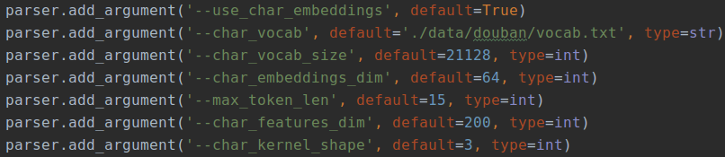
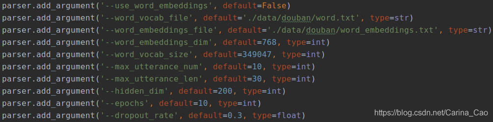
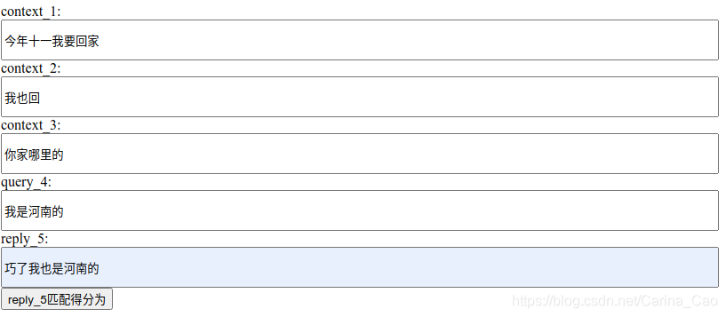

# TripleNet: 聊天机器人

多轮对话中基于检索的聊天机器人主要用于特定情景的聊天回复。

TripleNet 论文地址https://www.aclweb.org/anthology/K19-1069.pdf

源项目[README.md](./original.README.md)。

## 依赖

```
Python 3.5.5 :: Anaconda, Inc.
CUDA 8.0, cudnn 6.0
Ubuntu 16.04
keras==2.2.4
tensorflow-gpu==1.4
```

环境[安装文档](https://github.com/chatopera/triplenet/issues/1)。

## 数据集

TripleNet 的数据集分别有 douban corpus(中文)和 ubuntu corpus(英文)，由于我们不训练英文模型，这里只介绍 douban corpus。

### douban corpus

下载数据

```
./shell/download.sh
```

douban corpus 可分为三部分：train.txt，dev.txt，test.txt 。 详细信息可参考https://github.com/MarkWuNLP/MultiTurnResponseSelection

train.txt 和 test.txt 内容示例：

```
0 来 聊聊 哪 部 电影 的 哪个 镜头 让 你 哭 的 不能自已 the way home 孙子 说 要 吃 炸鸡腿 聋哑 奶奶 特意 宰 了一 只鸡 因为 奶奶 没 吃 过 炸鸡腿 她 不知道 怎么 做 就 白灼 了一 整 只鸡 她 撕下 一 只 鸡腿 递 给 孙子 小 孙子 不吃 说 不是 他 要 的 炸鸡腿 一直 嘟囔 着 我 要 吃 炸鸡腿 奶奶 一直 递 给 他 没 放下 过 哇 呜呜 呜 呜呜 呜 看得 我 要 哭 死 了 那 段 我 也 觉得 感人 还有 到了 市镇 给 小 孙子 买 巧克力 那 一段 我 像 是 缺 巧克力 的 人 嘛
0 来 聊聊 哪 部 电影 的 哪个 镜头 让 你 哭 的 不能自已 the way home 孙子 说 要 吃 炸鸡腿 聋哑 奶奶 特意 宰 了一 只鸡 因为 奶奶 没 吃 过 炸鸡腿 她 不知道 怎么 做 就 白灼 了一 整 只鸡 她 撕下 一 只 鸡腿 递 给 孙子 小 孙子 不吃 说 不是 他 要 的 炸鸡腿 一直 嘟囔 着 我 要 吃 炸鸡腿 奶奶 一直 递 给 他 没 放下 过 哇 呜呜 呜 呜呜 呜 看得 我 要 哭 死 了 那 段 我 也 觉得 感人 还有 到了 市镇 给 小 孙子 买 巧克力 那 一段 咱 还是 吃 夹 馍 吧
0 来 聊聊 哪 部 电影 的 哪个 镜头 让 你 哭 的 不能自已 the way home 孙子 说 要 吃 炸鸡腿 聋哑 奶奶 特意 宰 了一 只鸡 因为 奶奶 没 吃 过 炸鸡腿 她 不知道 怎么 做 就 白灼 了一 整 只鸡 她 撕下 一 只 鸡腿 递 给 孙子 小 孙子 不吃 说 不是 他 要 的 炸鸡腿 一直 嘟囔 着 我 要 吃 炸鸡腿 奶奶 一直 递 给 他 没 放下 过 哇 呜呜 呜 呜呜 呜 看得 我 要 哭 死 了 那 段 我 也 觉得 感人 还有 到了 市镇 给 小 孙子 买 巧克力 那 一段 地址 已 豆油 你
0 来 聊聊 哪 部 电影 的 哪个 镜头 让 你 哭 的 不能自已 the way home 孙子 说 要 吃 炸鸡腿 聋哑 奶奶 特意 宰 了一 只鸡 因为 奶奶 没 吃 过 炸鸡腿 她 不知道 怎么 做 就 白灼 了一 整 只鸡 她 撕下 一 只 鸡腿 递 给 孙子 小 孙子 不吃 说 不是 他 要 的 炸鸡腿 一直 嘟囔 着 我 要 吃 炸鸡腿 奶奶 一直 递 给 他 没 放下 过 哇 呜呜 呜 呜呜 呜 看得 我 要 哭 死 了 那 段 我 也 觉得 感人 还有 到了 市镇 给 小 孙子 买 巧克力 那 一段 楼主 你 谈 过 几 次 恋爱
0 来 聊聊 哪 部 电影 的 哪个 镜头 让 你 哭 的 不能自已 the way home 孙子 说 要 吃 炸鸡腿 聋哑 奶奶 特意 宰 了一 只鸡 因为 奶奶 没 吃 过 炸鸡腿 她 不知道 怎么 做 就 白灼 了一 整 只鸡 她 撕下 一 只 鸡腿 递 给 孙子 小 孙子 不吃 说 不是 他 要 的 炸鸡腿 一直 嘟囔 着 我 要 吃 炸鸡腿 奶奶 一直 递 给 他 没 放下 过 哇 呜呜 呜 呜呜 呜 看得 我 要 哭 死 了 那 段 我 也 觉得 感人 还有 到了 市镇 给 小 孙子 买 巧克力 那 一段 为什么 要 撤 下 呢 如果 是 狮 女 在 朋友 面前 强烈 说明 你们 不是 男女 朋友 关系 那 是 因为 你们 就不 是啊 我 觉得 她 反应 越 强烈 说明 她 越 在乎 心里 有 小九九 否则 狮 女 应该 不会 有 太 大 反映 的 而且 从 巧克力 这 件 事 上 我 觉得 她 明显 不 只是 把 你 当 普通 朋友 而已 个人 看法
0 来 聊聊 哪 部 电影 的 哪个 镜头 让 你 哭 的 不能自已 the way home 孙子 说 要 吃 炸鸡腿 聋哑 奶奶 特意 宰 了一 只鸡 因为 奶奶 没 吃 过 炸鸡腿 她 不知道 怎么 做 就 白灼 了一 整 只鸡 她 撕下 一 只 鸡腿 递 给 孙子 小 孙子 不吃 说 不是 他 要 的 炸鸡腿 一直 嘟囔 着 我 要 吃 炸鸡腿 奶奶 一直 递 给 他 没 放下 过 哇 呜呜 呜 呜呜 呜 看得 我 要 哭 死 了 那 段 我 也 觉得 感人 还有 到了 市镇 给 小 孙子 买 巧克力 那 一段 嗯嗯 这个 我 要 打听 打听 她 家 的 情况 了
0 来 聊聊 哪 部 电影 的 哪个 镜头 让 你 哭 的 不能自已 the way home 孙子 说 要 吃 炸鸡腿 聋哑 奶奶 特意 宰 了一 只鸡 因为 奶奶 没 吃 过 炸鸡腿 她 不知道 怎么 做 就 白灼 了一 整 只鸡 她 撕下 一 只 鸡腿 递 给 孙子 小 孙子 不吃 说 不是 他 要 的 炸鸡腿 一直 嘟囔 着 我 要 吃 炸鸡腿 奶奶 一直 递 给 他 没 放下 过 哇 呜呜 呜 呜呜 呜 看得 我 要 哭 死 了 那 段 我 也 觉得 感人 还有 到了 市镇 给 小 孙子 买 巧克力 那 一段 说不定 是 个 孙 女儿 你 就 变 外婆 了
1 来 聊聊 哪 部 电影 的 哪个 镜头 让 你 哭 的 不能自已 the way home 孙子 说 要 吃 炸鸡腿 聋哑 奶奶 特意 宰 了一 只鸡 因为 奶奶 没 吃 过 炸鸡腿 她 不知道 怎么 做 就 白灼 了一 整 只鸡 她 撕下 一 只 鸡腿 递 给 孙子 小 孙子 不吃 说 不是 他 要 的 炸鸡腿 一直 嘟囔 着 我 要 吃 炸鸡腿 奶奶 一直 递 给 他 没 放下 过 哇 呜呜 呜 呜呜 呜 看得 我 要 哭 死 了 那 段 我 也 觉得 感人 还有 到了 市镇 给 小 孙子 买 巧克力 那 一段 但是 我 总是 忘记 这 剧 的 名字
0 来 聊聊 哪 部 电影 的 哪个 镜头 让 你 哭 的 不能自已 the way home 孙子 说 要 吃 炸鸡腿 聋哑 奶奶 特意 宰 了一 只鸡 因为 奶奶 没 吃 过 炸鸡腿 她 不知道 怎么 做 就 白灼 了一 整 只鸡 她 撕下 一 只 鸡腿 递 给 孙子 小 孙子 不吃 说 不是 他 要 的 炸鸡腿 一直 嘟囔 着 我 要 吃 炸鸡腿 奶奶 一直 递 给 他 没 放下 过 哇 呜呜 呜 呜呜 呜 看得 我 要 哭 死 了 那 段 我 也 觉得 感人 还有 到了 市镇 给 小 孙子 买 巧克力 那 一段 哎 算 了 要 淡定
0 来 聊聊 哪 部 电影 的 哪个 镜头 让 你 哭 的 不能自已 the way home 孙子 说 要 吃 炸鸡腿 聋哑 奶奶 特意 宰 了一 只鸡 因为 奶奶 没 吃 过 炸鸡腿 她 不知道 怎么 做 就 白灼 了一 整 只鸡 她 撕下 一 只 鸡腿 递 给 孙子 小 孙子 不吃 说 不是 他 要 的 炸鸡腿 一直 嘟囔 着 我 要 吃 炸鸡腿 奶奶 一直 递 给 他 没 放下 过 哇 呜呜 呜 呜呜 呜 看得 我 要 哭 死 了 那 段 我 也 觉得 感人 还有 到了 市镇 给 小 孙子 买 巧克力 那 一段 发现 已经 有 了

```

以上内容形式为: label \t utterance \t utterance \t utterance \t utterance \t response

train.txt 是以每 10 条内容为单位的，每条的 utterances 都一样，只有 response 不一样，其中标签为 1 的个数不定，有少数标为全 0，大部分情况是 10 条内容里有 1 个标签为 1 的，在训练前整个文件都要打乱。

dev.txt 是以每 2 条内容为单位的，一般标签为 1 个 0 和 1 个 1。

test.txt 也是以每 10 条内容为单位(不打乱，方便衡量标准的计算)。

## 模型训练

```
./shell/train_douban.sh
```

TripleNet 训练分为 char_embedding 和 word_embedding 两种方式。

### char_embedding 训练

数据预处理
将 token 转换为 char 对应的 id，与 feature 一起作为处理结果。feature 的数值为 1.0 或 0.0，当 context 中的某个词出现在 reply 中时，对应的 feature 取值为 1.0，否则为 0.0。

char_id 和 feature 都分别包括三个内容：context，query，reply。context 也含有 query。

#### 模型结构

embedding 层：根据字典将 char_id 转换为对应的 char_emb，与 feature 做联结生成 emb。char_emb 和 emb 一起作为该层输出。char_emb 和 emb 均包含三项内容：context，query，reply。

shared_encoding 层：将 embedding 层输出作为输入，该层构建了隐藏层维度为 200 的双向 lstm。分别对 emb 三项做双向 lstm 操作，输出为 word_repr。

triple_attention 层：对 word_repr 三项和 char_emb 三项分别做 triple_attention，triple_attention 操作具体为对输入的三项两两组合分别做 bi_directional_attention,add 和 BN 操作。后面的操作非常复杂，包括 utterance repr，context level repr，triple matching，fusion 等内容。

fusion 层：具体过程为 双向 lstm->全局最大池化->双向 lstm->全局最大池化->全连接。

参数设置如下：



训练后的模型准确率与论文中的数据相比低了 2 个百分点左右，但比 word_embedding 训练后的模型效果好。

### word_embedding 训练

数据预处理
将 token 转换为 word 对应的 id，与 feature 一起作为处理结果。feature 的数值为 1.0 或 0.0，当 context 中的某个词出现在 reply 中时，对应的 feature 取值为 1.0，否则为 0.0。

word_id 和 feature 都分别包括三个内容：context，query，reply。context 也含有 query。

#### 模型结构

embedding 层：根据字典将 word_id 转换为对应的 word_emb，与 feature 做联结生成 emb。emb 作为该层输出。emb 包含三项内容：context，query，reply。

shared_encoding 层：将 embedding 层输出作为输入，该层构建了隐藏层维度为 200 的双向 lstm。分别对 emb 三项做双向 lstm 操作，输出为 word_repr。

triple_attention 层：对 word_repr 三项做 triple_attention，triple_attention 操作具体为对输入的三项两两组合分别做 bi_directional_attention,add 和 BN 操作。后面的操作非常复杂，包括 utterance repr，context level repr，triple matching，fusion 等内容。

fusion 层：具体过程为 双向 lstm->全局最大池化->双向 lstm->全局最大池化->全连接。

参数设置如下：



值得注意的是源码中没有提供 word_embedding.txt 文件，需要自己生成。可使用 bert 或 word2vector 处理 word.txt 文件生成 word_embedding.txt。这里是用 bert(pooler 层作为输出)生成的。

## 训练后的模型准确率为(上下有波动)：

测试模型

```
./shell/test_douban.sh
```

MRR:0.5743431855500813 MAP:0.5240644202180836 P1:0.391304347826087 R10@1:0.22751005449656123 R10@2:0.3912127269698484 R10@5:0.7294947764213134

### 衡量标准

MRR
假如 10 条中正确答案分别出现在第 1、3、6、9、10 位，那么 RR=（1/1+1/3+1/6+1/9+1/10）

MRR = RR 总和 / 样本总个数

MAP
假如 10 条中正确答案分别出现在第 1、3、6、9、10 位，那么 AP=(1/1+2/3+3/6+4/9+5/10)/5=0.62。

mAP = AP 总和 / 样本总个数

P1
P1 = 所有第一个返回是正确答案的个数 / 样本总个数

R10@1
recall_1 = 每 10 条中第 1 个返回正确答案的个数 / 10 条中样本正例个数

R10@1 = recall_1 总和 / 样本总个数

R10@2
recall_2 = 每 10 条中前 2 个返回正确答案的个数 / 10 条中样本正例个数

R10@2 = recall_2 总和 / 样本总个数

R10@5
recall_5 = 每 10 条中前 5 个返回正确答案的个数 / 10 条中样本正例个数

R10@5 = recall_5 总和 / 样本总个数

## http server

编写了 TripleNet 的推理接口自测模型，基于推理接口又写了 http server 接口供大家测试，同局域网内主机访问 http://×.×.×.×:8832/post。



点击下面的按钮，返回得分：

```
{"result": "0.9999"}
```

可多次更换 reply_5，测试模型效果，此处使用的是 char_embedding 训练的模型。

## 文章

[论文阅读 TripleNet: Triple Attention Network for Multi-Turn Response Selection in Retrieval-based Chatbot](https://blog.csdn.net/liuy9803/article/details/104679609?utm_medium=distribute.wap_relevant.none-task-blog-title-6)

[基于检索的聊天机器人之 TripleNet
](https://blog.csdn.net/Carina_Cao/article/details/108534918)

## 开源许可协议

Copyright (2020) <a href="https://www.chatopera.com/" target="_blank">北京华夏春松科技有限公司</a>

Copyright (2019) <a href="https://github.com/wtma/TripleNet" target="_blank">wtma</a>

[Apache License Version 2.0](./LICENSE)

[![chatoper banner][co-banner-image]][co-url]

[co-banner-image]: https://static-public.chatopera.com/assets/images/42383104-da925942-8168-11e8-8195-868d5fcec170.png
[co-url]: https://www.chatopera.com
